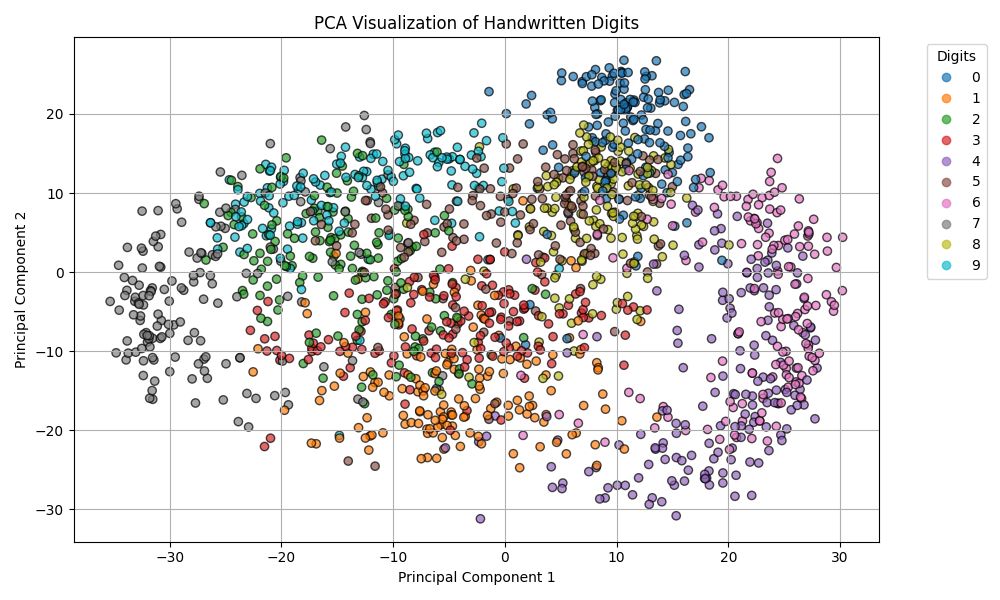

# K-Nearest Neighbors (KNN) for Handwritten Digit Recognition [from scratch]

## Overview
This project implements a handwritten digit recognition system using the K-Nearest Neighbors (KNN) algorithm **from 
scratch using numpy only**. The dataset consists of images of digits (0-9), each represented as a 16x15 grayscale image, 
reshaped into a 240-dimensional feature vector. The dataset contains 2000 images (200 per digit).


The following figure shows 10 pictures of each digit (0-9) using data from digit picture dataset file (mfeat-pix.txt):
<br/>

<<<<<<< Updated upstream
<br/>

=======
<<<<<<< Updated upstream
The following figure shows graph of accuracy vs K neighbors:


### Installation
1. Create a virtual environment.
2. Use `requirements.txt` to install the required libraries as follows:
=======
<br/><br/>

The following figure shows plot for reducing 240D image samples to 2D samples:<br/><br/>
<br/><br/>

The following figure shows graph of accuracy vs K neighbors:<br/><br/>
<br/><br/>

>>>>>>> Stashed changes
## Dataset

- File: data/mfeat-pix.txt
- Total Images: 2000
- Image Size: 16x15 (Flattened to 240 features)
- Labels: 0-9 (Each digit has 200 samples)
- Train-Test Split: 80% Training (1600 images), 20% Testing (400 images)

## Algorithm Implementation
The KNN classification algorithm is implemented from scratch using NumPy, following these steps:

#### Preprocessing:
- Load the dataset
- Shuffle the images and labels
- Split into training and testing sets

#### Distance Calculation:
- Compute Euclidean distance between the test sample and all training samples.

#### Find Nearest Neighbors:
- Sort training samples by distance
- Select the K nearest samples

#### Majority Voting:
- Count label occurrences in the K nearest samples
- Assign the most frequent label as the predicted class

#### Evaluation:
- The model is tested on different values of K
- Accuracy is computed by comparing predictions with actual labels

### Results
- Accuracy decreases as K increases. This suggests that smaller values of K work better for this dataset.
- The highest accuracy (~98%) is observed when K=3. This means that considering a small number of nearest neighbors 
leads to better classification.
- As K increases, accuracy gradually declines. This could be due to the inclusion of more distant neighbors, which 
<<<<<<< Updated upstream
introduces noise and misclassification. After K=10, accuracy stabilizes but then starts declining more sharply. We can
observe from the plot obtained after performing PCA to reduce 240 dimentional image samples to 2D samples. This provides 
way to visualize how image samples cluster in data space.
- Based on the graph, K=3 or K=5 seem to be the best choices. A too-small K (e.g., K=1) might lead to overfitting, while
a too-large K reduces accuracy due to class overlap.

The following figure shows plot for reducing 240D image samples to 2D samples:<br/><br/>
<br/><br/>

The following figure shows graph of accuracy vs K neighbors:<br/><br/>
<br/><br/>

## How to Run
=======
introduces noise and misclassification. After K=10, accuracy stabilizes but then starts declining more sharply.
- We can observe from the plot obtained after performing PCA to reduce 240 dimentional image samples to 2D samples.
This provides a way to visualize clusters of image samples in data space. The clusters representing digits are in close 
proximity leading to lower accuracy for large values of K.
- Based on the graph, K=3 or K=5 seem to be the best choices. A too-small K (e.g., K=1) might lead to overfitting, while
a too-large K reduces accuracy due to class overlap.


## How to Run
>>>>>>> Stashed changes
>>>>>>> Stashed changes
```
python main.py
```

## Future Prospects

- Implement cross-validation for better hyperparameter tuning.
- Optimize distance calculations for faster execution.
- Try alternative distance metrics (e.g., Manhattan distance).
