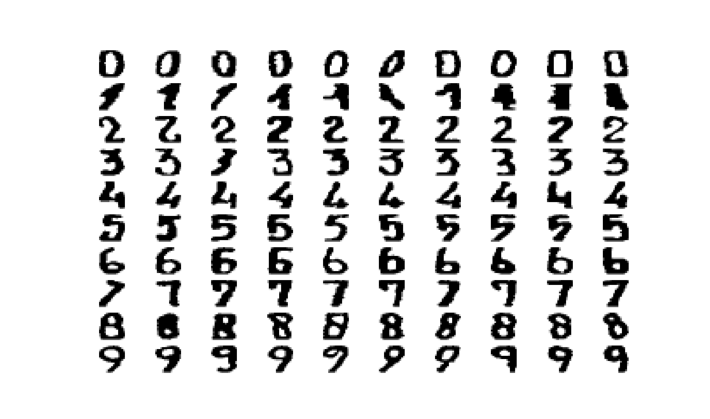
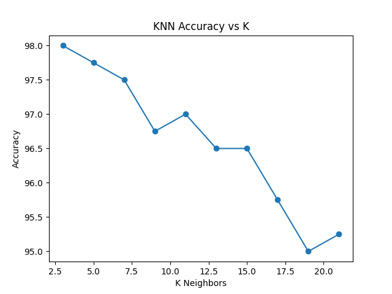

# Hand Written Digit Recognition

This is a hand written digit recognition project for machine learning enthusiasts to get hands-on experience of the 
basic machine learning algorithms. The project demonstrates internal mechanism of the common machine learning
algorithms. The implementation intentionally does not include sophisticated ML libraries to achieve this objective.

## Project Scope

The digit picture dataset contains data of 2000 grey scale pictures with 200 images of each 10 digits (0-9). The size of
each picture is 16X15 and stored as a string of 240 decimal digits (ranging 0-6).

Image Dataset is reshaped into 10X200x240 for easier indexing. Then it is divided into training data (80%) and testing
data (20%).

The following figure shows 10 pictures of each digit (0-9) using data from digit picture dataset file (mfeat-pix.txt):
<br/><br/>


## Neural Networks

### Algorithm
...

### Results
...

## K-Nearest Neighbours

### Algorithm

1. Find the K Nearest Neighbors based on Euclidean Distance between pictures. The value of K = 4 for a single try.
2. The counts of samples of each class is determined, and the sample class with the highest count is assigned to the
   test sample.
3. The class of each test sample is determined similarly.
4. Then accuracy is calculated by the ratio of test samples predicted correctly by the model over total test samples.

Finally, the same algorithm is repeatedly called with various values of K to get a graph between K vs Accuracy.

The project also evaluate accuracy versus K number of neighbors.

### Results

The following figure shows graph of accuracy vs K neighbors:<br/><br/>


##### Findings

The plot is an illustration of 'Elbow Method' and shows that the accuracy peaks when k is in range of 5 - 10. Then the
accuracy sharply decreases indicating accuracy peak as overfit of the model. The sharp decrease in accuracy is due
to the generalization of model. The further slow decrease in accuracy is supported by the fact that overall cost
function is non-increasing function which is to calculate minimum distance between mean (centroid) and the data points. 
The elbow curve is **not a smooth decreasing function** indicating reliability of the chosen method to determine optimum
value of K. The reason for non-smoothness and more like elbow shape is because each handwritten digit group (group of 
samples indicating 0s, 1s and so on) has distinct features of that particular digit present in the data (i.e. numerical
representation) and when K reaches near the optimum value, the model generalizes. This is a trade-off for the decrease
in train cost vs increase in test cost leading to little bit lesser accuracy than smaller values of K (overfit case).

## Installation
1. Create a virtual environment.
2. Use `requirements.txt` to install the required libraries as follows:
```
pip install -r requirements.txt
```

## Future Prospects
...
